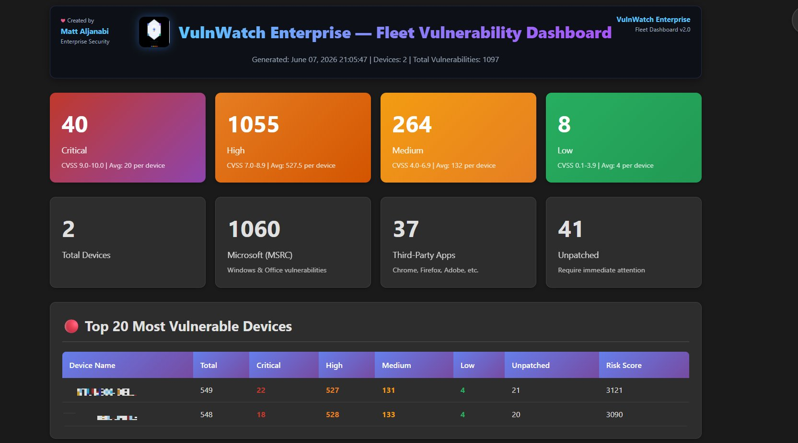
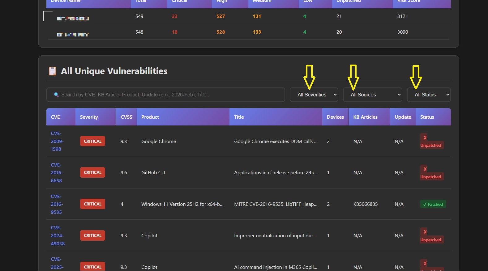
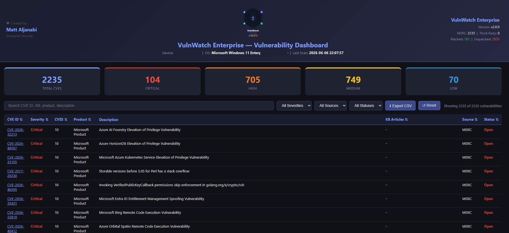

<p align="center">
  
</p>

<h1 align="center">VulnWatch — Enterprise Vulnerability Dashboard</h1>

<p align="center">
PowerShell-based vulnerability collection and reporting for Windows fleets. Scans devices,
enriches findings against MSRC and NVD, stores results in SharePoint Online / Microsoft
Planner, and renders a self-contained HTML dashboard.
</p>

---

> ## ⚠️ Disclaimer
>
> This software is provided **"as is", without warranty of any kind**, express or implied,
> including but not limited to the warranties of merchantability, fitness for a particular
> purpose, and non-infringement. In no event shall the authors or copyright holders be
> liable for any claim, damages, or other liability arising from the use of this software.
>
> - **Use at your own risk.** Test in a non-production environment before fleet-wide deployment.
> - This is an **independent, community project**. It is **not affiliated with, endorsed by,
>   or supported by Microsoft**. "MSRC", "Entra", "Intune", "Defender", "SharePoint", and
>   "Planner" are trademarks of Microsoft Corporation, referenced here for descriptive
>   purposes only.
> - You are responsible for complying with the terms of any API you query
>   (MSRC, NVD, Microsoft Graph) and with your organization's security and data-handling
>   policies. Scan only systems you are authorized to assess.
> - Output files (JSON, CSV, HTML) may contain **sensitive vulnerability and system data**.
>   Store and share them accordingly.
> - **You must supply your own credentials.** No tenant IDs, client IDs, secrets, API keys,
>   or URLs are included in this repository — see [`CONFIGURATION_GUIDE.md`](CONFIGURATION_GUIDE.md).

---

## ⚙️ First-time setup — replace these placeholders

This repo ships with **placeholders instead of real values**. Before running anything,
provide your own (see `CONFIGURATION_GUIDE.md`):

| Placeholder | What to provide | Where to get it |
|---|---|---|
| `<YOUR_ENTRA_TENANT_ID>` | Entra tenant ID (GUID) | Entra admin center → Overview |
| `<YOUR_APP_CLIENT_ID>` | App registration's Application (client) ID | Entra → App registrations |
| `<YOUR_CLIENT_SECRET>` | Client secret **value** | Entra → App → Certificates & secrets |
| `<YOUR_NVD_API_KEY>` | Free NVD API key | https://nvd.nist.gov/developers/request-an-api-key |
| `https://<YOUR-TENANT>.sharepoint.com/sites/<YOUR-SITE>` | Your SharePoint site URL | `SHAREPOINT_SETUP_GUIDE.md` |
| `<YOUR_SHAREPOINT_DRIVE_ID>` | Document-library Drive ID | Graph: `GET /sites/{site-id}/drives` |

**Recommended:** set these as environment variables rather than editing the scripts, so
secrets never end up in source control. The scripts read them from `$env:` and fall back to
the placeholders only when the variable is absent.

---

PowerShell scripts to check Windows devices for vulnerabilities based on Microsoft Security Response Center (MSRC) data with color-coded severity display.

## Features

- ✅ Scans installed Windows updates and applications
- ✅ Queries MSRC vulnerability database
- ✅ Color-coded severity display:
  - **Critical (CVSS 9.0-10.0)**: Dark Red
  - **High (CVSS 7.0-8.9)**: Red
  - **Medium (CVSS 4.0-6.9)**: Yellow
  - **Low (CVSS 0.1-3.9)**: Green
- ✅ Identifies unpatched vulnerabilities
- ✅ Exports results to CSV
- ✅ Checks against recent security bulletins

## Screenshots

### Fleet Dashboard — summary view
Total CVEs broken down by severity, device counts, MSRC vs third-party split, and the
most vulnerable devices ranked by risk score.



### All Unique Vulnerabilities — searchable, filterable table
Every CVE across the fleet with CVSS score, affected product, device count, KB articles,
and remediation status. Filter by severity, source, and status.



### Per-device Dashboard
Single-device view: total CVEs, severity breakdown, patched vs unpatched, and a full
CVE detail table with CSV export.



## Scripts Included

### 1. Check-MSRCVulnerabilities.ps1
Uses the MSRCSecurityUpdates PowerShell module (will auto-install if needed).

**Pros:**
- Official Microsoft module
- Comprehensive vulnerability data
- Well-structured API

**Cons:**
- Requires module installation
- May need administrator privileges

### 2. Check-MSRCVulnerabilities-API.ps1 (Recommended)
Directly queries the MSRC REST API without additional modules.

**Pros:**
- No module installation required
- Lightweight and portable
- Works with standard user privileges
- Faster execution

**Cons:**
- Direct API parsing

## Requirements

- Windows PowerShell 5.1 or later (or PowerShell 7+)
- Internet connection
- Execution policy allowing script execution

## Quick Start

### Check Execution Policy
```powershell
Get-ExecutionPolicy
```

If restricted, set to RemoteSigned (run as Administrator):
```powershell
Set-ExecutionPolicy RemoteSigned -Scope CurrentUser
```

### Run the Scanner

**Option 1: Using API version (Recommended)**
```powershell
.\Check-MSRCVulnerabilities-API.ps1
```

**Option 2: Using Module version**
```powershell
.\Check-MSRCVulnerabilities.ps1
```

## Usage Examples

### Basic Scan
```powershell
.\Check-MSRCVulnerabilities-API.ps1
```

### Scan with CSV Export
```powershell
.\Check-MSRCVulnerabilities-API.ps1 -ExportCSV
```

### Scan Last 6 Months
```powershell
.\Check-MSRCVulnerabilities-API.ps1 -Months 6
```

### Custom Export Path
```powershell
.\Check-MSRCVulnerabilities-API.ps1 -ExportCSV -OutputPath "C:\Reports\VulnScan.csv"
```

### Run on Remote Computers
```powershell
$computers = "PC01", "PC02", "PC03"

foreach ($computer in $computers) {
    Invoke-Command -ComputerName $computer -FilePath .\Check-MSRCVulnerabilities-API.ps1
}
```

## Output Example

```
═══════════════════════════════════════════════════════════
  Microsoft Security Response Center Vulnerability Scanner
═══════════════════════════════════════════════════════════

Device Information:
  Computer: DESKTOP-ABC123
  OS: Microsoft Windows 11 Pro
  Build: 22631
  Architecture: 64-bit

Installed Updates: 127

Analyzing 3 recent security bulletins...
Date Range: 2025-Nov to 2026-Feb

Processing 2026-Jan...

[Critical] CVSS: 9.8 | CVE-2026-12345
  Remote Code Execution in Windows SMB
  KB Articles: KB5034567
  Status: NOT PATCHED

[Important] CVSS: 7.8 | CVE-2026-23456
  Elevation of Privilege in Windows Kernel
  KB Articles: KB5034568
  Status: PATCHED

[Moderate] CVSS: 5.5 | CVE-2026-34567
  Information Disclosure in Windows DNS
  KB Articles: KB5034569
  Status: NOT PATCHED

═══════════════════════════════════════════════════════════
  VULNERABILITY SUMMARY
═══════════════════════════════════════════════════════════

Total Vulnerabilities Found: 47

By Severity:
  Critical:  5
  Important: 18
  Moderate:  20
  Low:       4

Unpatched Vulnerabilities: 12

═══════════════════════════════════════════════════════════
```

## CSV Export Fields

The exported CSV contains:
- **CVE**: CVE identifier
- **Title**: Vulnerability description
- **Severity**: Critical/Important/Moderate/Low
- **CVSSScore**: CVSS base score
- **Update**: MSRC bulletin ID (e.g., 2026-Jan)
- **KBArticles**: Related KB article numbers
- **IsPatched**: True/False status
- **AffectedProducts**: List of affected products

## Severity Color Mapping

| Severity | CVSS Score | Color |
|----------|-----------|-------|
| Critical | 9.0 - 10.0 | Dark Red |
| Important/High | 7.0 - 8.9 | Red |
| Moderate/Medium | 4.0 - 6.9 | Yellow |
| Low | 0.1 - 3.9 | Green |

## Automation & Scheduling

### Schedule Daily Scan (Task Scheduler)
```powershell
$action = New-ScheduledTaskAction -Execute "PowerShell.exe" `
    -Argument "-File C:\Scripts\Check-MSRCVulnerabilities-API.ps1 -ExportCSV"

$trigger = New-ScheduledTaskTrigger -Daily -At 9am

Register-ScheduledTask -TaskName "MSRC Vulnerability Scan" `
    -Action $action -Trigger $trigger -Description "Daily MSRC vulnerability check"
```

### Run Across Domain Computers
```powershell
$computers = Get-ADComputer -Filter * | Select-Object -ExpandProperty Name

$results = Invoke-Command -ComputerName $computers -FilePath .\Check-MSRCVulnerabilities-API.ps1 -ErrorAction SilentlyContinue

$results | Export-Csv "C:\Reports\DomainVulnerabilityScan.csv" -NoTypeInformation
```

## Troubleshooting

### "Script cannot be loaded because running scripts is disabled"
```powershell
Set-ExecutionPolicy RemoteSigned -Scope CurrentUser
```

### "Unable to retrieve MSRC update list"
- Check internet connection
- Verify firewall allows PowerShell to access api.msrc.microsoft.com
- Try running as Administrator

### Module Installation Issues (Module version only)
```powershell
# Install module manually
Install-Module -Name MSRCSecurityUpdates -Scope CurrentUser -Force
```

### Slow Performance
- Reduce months parameter: `-Months 2`
- Use API version instead of module version
- Scan during off-hours

## API Rate Limiting

The MSRC API has rate limits. If scanning many devices:
- Add delays between scans: `Start-Sleep -Seconds 5`
- Schedule scans across different times
- Cache MSRC data locally if scanning multiple devices

## Security Considerations

- Scripts require internet access to MSRC API
- No credentials are transmitted
- Installed KB list is read locally
- CSV exports may contain sensitive system information
- Secure export paths and restrict access

## Resources

- **MSRC Portal**: https://msrc.microsoft.com/update-guide/vulnerability
- **MSRC API Documentation**: https://api.msrc.microsoft.com/cvrf/v2.0/swagger/index
- **CVE Database**: https://cve.mitre.org/
- **CVSS Calculator**: https://nvd.nist.gov/vuln-metrics/cvss/v3-calculator

## License

These scripts are provided as-is for security assessment purposes. Use at your own risk.

## Contributing

Suggestions and improvements welcome! Common enhancements:
- Add email notifications for critical vulnerabilities
- Integration with SIEM systems
- HTML report generation
- Compliance mapping (NIST, CIS, etc.)

## Version History

- **v1.0** - Initial release with color-coded severity and CSV export
